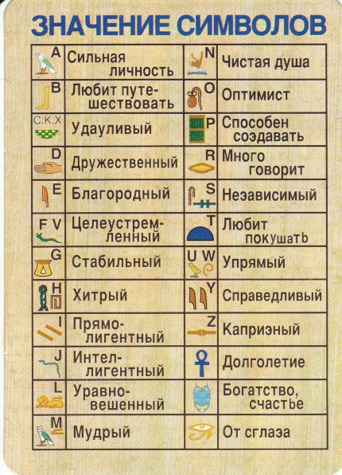
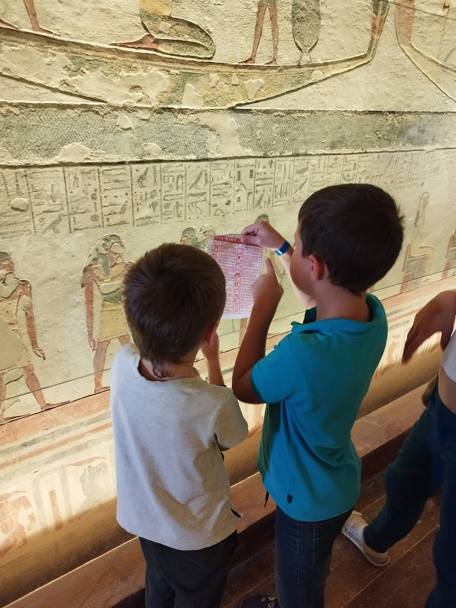
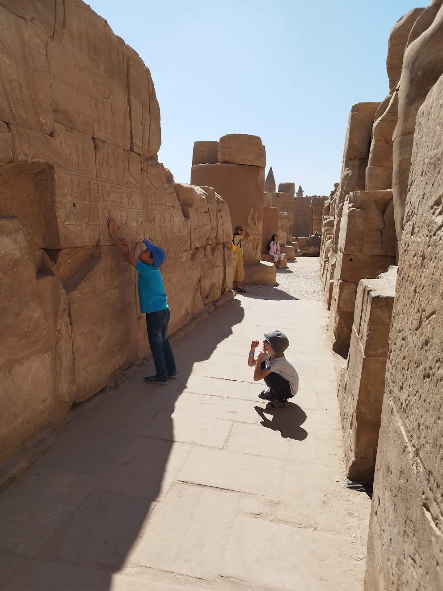

# Глава 1. Введение

Однажды, отдыхая семьей в Египте, мы отправились на экскурсию в Луксор, к знаменитому Карнакскому храму. Еще
в автобусе гид раздал каждому листочек с алфавитом, записанным иероглифами.

Дети тут же с азартом принялись расшифровывать собственные имена, перебивая друг друга и споря: \
— Я - дружелюбный и мудрый! \
— А я - благородный! \
— А ты…(это они про меня) - ха-ха, любишь покушать!

Всю оставшуюся дорогу они пребывали в радостном предвкушении: ведь в руки им попал «ключ к тайнам древних текстов», а
впереди ждали великие открытия, клады и сокровища.

Но стоило нам оказаться среди исписанных иероглифами колонн Карнака, как стало ясно: листочки совершенно бесполезны.
Сколько ни старались дети прочесть хотя бы одну короткую надпись — ничего не получалось.

Тогда я объяснил, что древнеегипетский — язык идеографический: каждый знак это не буква, а картинка или образ.
И тут, дело пошло веселее: \
— О! Смотри, здесь написано: «Солнце взошло, и вода полилась на пианино!»

Я же смотрел на эту картину с умилением и легкой завистью - и мне хотелось читать иероглифы с такой же
легкостью и непринужденностью. Тогда я решил, что когда я вернусь домой, то напишу такую программу, которая
поможет и мне понимать иероглифы.

