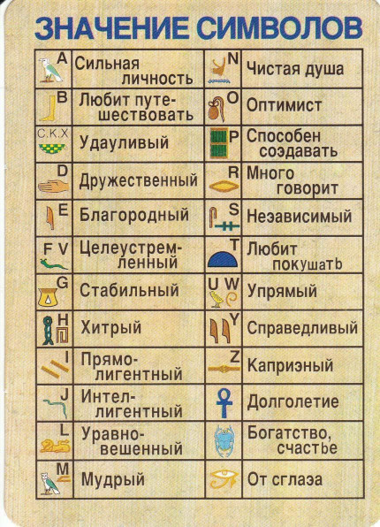

# Введение

Однажды, отдыхая семьей в Египте, мы отправились на экскурсию в Луксор, к знаменитому Карнакскому храму. Еще
в автобусе гид раздал каждому листочки с алфавитом, записанным иероглифами. 

Дети тут же с азартом принялись
расшифровывать имена, перебивая друг-друга и споря: «Я — дружелюбный и мудрый!», «А я — благородный!», «А
ты… ха-ха, любишь покушать!». Всю оставшуюся дорогу они пребывали в радостном предвкушении: еще бы - к ним
в руки попал ключ к тайнам древних текстов, впереди ждали великие открытия, тайны, клады и сокровища!

Но стоило им оказаться среди исписанных иероглифами колонн Карнака, как стало ясно, что листочки 
совершенно бесполезны - как дети ни старались прочитать хоть одну короткую надпись, ничего не выходило.

Тогда я объяснил, что древнеегипетский — язык идеографический: каждый знак это не буква, а картинка или образ.
И тут, дело сразу пошло веселее: «О! Смотри, здесь написано: „Солнце взошло, и вода полилась на пианино!“»

Я же смотрел на эту картину с умилением и легкой завистью - и мне хотелось читать иероглифы с такой же 
легкостью и непринужденностью. Тогда я решил, что когда я приеду домой, то напишу такую программу, которая 
поможет и мне понимать иероглифы.

